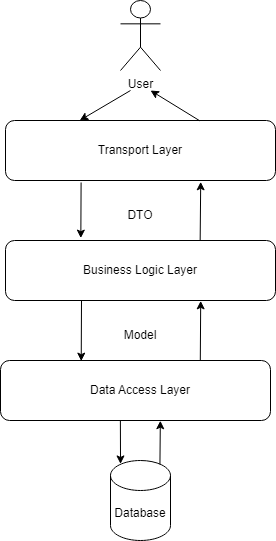

# BookRESTAPI - Book Management REST API

BookRESTAPI is a straightforward REST API implemented in Go language, designed to facilitate book management. It offers fundamental CRUD operations on a PostgreSQL database through its HTTP RESTful API.

## Technologies

- Go 1.21
- PostgreSQL 15
- Docker

## Architecture Overview

The architecture of BookRESTAPI is designed around a well-organized, layered approach that ensures clear separation of responsibilities and promotes modularity. The system comprises the following core components:



1. **Transport Layer**:  Acts as the initial point of contact for incoming requests. It manages incoming HTTP requests, routing them efficiently through the Gorilla Mux router. Operating on Data Transfer Objects (DTOs), this layer handles request authentication, authorization, and validation before forwarding them to subsequent layers. Its primary responsibilities include request reception, input validation, and data transformation into DTOs. Processed DTOs are then passed to the Business Logic Layer for further handling. The implementation is located in the `./internal/api` directory.

2. **Business Logic Layer**: Responsible for processing DTOs received from the Transport Layer. Its core function involves translating these DTOs into domain-specific models that encapsulate key application concepts. The Business Logic Layer embodies the fundamental business rules and logic that govern the application's functionality. Furthermore, it manages user registration, login, and token generation functionalities. Once operations on models are executed, the Business Logic Layer interacts with the Data Access Layer for data storage and retrieval. The implementation resides in the `./internal/services` directory.

3. **Data Access Layer**: Oversees interactions with the database and other data storage systems. It receives domain-specific models from the Business Logic Layer, transforming them into appropriate database queries or operations. The Data Access Layer handles data reading and writing, maintaining data integrity. Upon data retrieval, it converts database results back into models and relays them to the Business Logic Layer. Implementation details can be found in the `./internal/database` directory.

By adhering to this architectural paradigm, the BookRESTAPI application gains essential attributes such as clear separation of concerns, enhanced maintainability, and scalability. Each layer can be developed, tested, and modified independently, fostering a coherent and well-organized codebase.

## Key Dependencies

- `mux` (github.com/gorilla/mux): Facilitates API server creation.
- `jwt` (github.com/golang-jwt/jwt): Simplifies JWT token management.
- `viper` (github.com/spf13/viper): Manages configurations efficiently.
- `testify` (github.com/stretchr/testify): Enhances testing capabilities.
- `pqx` (github.com/jackc/pgx/v5): Facilitates interaction with PostgreSQL databases.
- `crypto` (golang.org/x/crypto): Utilized for bcrypt hashing.
- `zap` (go.uber.org/zap): Employs structured and efficient logging.

## Requirements

To run the application, make sure you have Docker installed on your system.

## Getting Started

### Installation and Running the `BookRESTAPI Server`

1. Clone the repository:

```
git clone https://github.com/MSSkowron/BookRESTAPI
```

2. Navigate to the project directory:

```
cd BookRESTAPI
```

3. Start the server using Docker Compose:

```
docker compose up
```

The server will be accessible at <http://localhost:8080>.

### Using the API

The BookRESTAPI exposes the following endpoints and methods:

#### User Registration

`\register` Method: `POST`

Registers a new user.

Request Body:

```json
{
  "email": "string",
  "password": "string",
  "firstName": "string",
  "lastName": "string",
  "age": "int64"
}
```

Response Body:

```json
{
  "id": "int64",
  "created_at": "time.Time",
  "email": "string",
  "password": "string",
  "firstName": "string",
  "lastName": "string",
  "age": "int64"
}
```

#### User Login

`\login` Method: `POST`

Authenticates a user and returns an authentication token.

Request Body:

```json
{
  "email": "string",
  "password": "string"
}
```

Response Body:

```json
{
  "token": "string"
}
```

#### Book Management

Authentication bearer token received during login must be included to perform book management requests. Set the bearer token with the key "Authorization" in the request header for the above endpoints. The bearer authentication header should be set as follows:

```
"Authorization": "Bearer <token>"
```

Available endpoints:

- `\books` Method: `GET`

  Retrieves a list of all books.

- `\books` Method: `POST`

  Creates a new book.

  Request Body:

  ```json
  {
    "author": "string",
    "title": "string"
  }
  ```

- `\books\{id}` Method: `GET`

  Retrieves details of a specific book by ID.

- `\books\{id}` Method: `PUT`

  Updates the details of a specific book by ID.

  Request Body:

  ```json
  {
    "author": "string",
    "title": "string"
  }
  ```

- `\books\{id}` Method: `DELETE`

  Deletes a specific book by ID.

#### Errors

In case of errors, the server returns an appropriate status code and JSON in the following format:

```json
{
  "error": "string"
}
```

## License

The project is available as open source under the terms of the MIT License.
